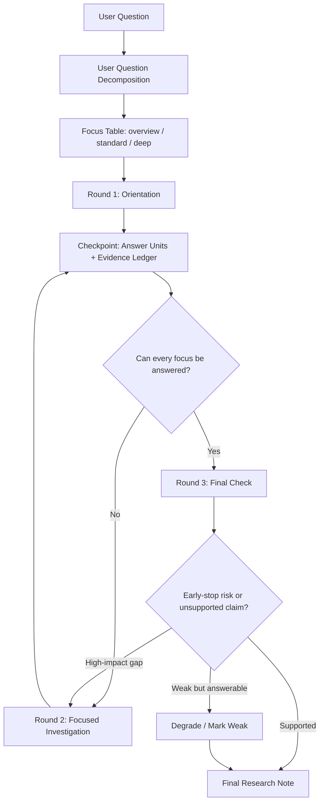

<div align="center">

# Explore Skill

### Research-grade paper, topic, system, and innovation analysis for Codex-style agents

<p>
  
  
  
  
</p>

<p>
  <b>把“这篇论文在干什么、创新点是什么、机制是否成立、有什么值得迁移”变成可调度、可查证、可压缩的研究流程。</b>
</p>

</div>

---

## What Is This

`explore-skill` 是一个面向 Codex / Agent Skills 体系的研究分析 skill。它不是普通“总结论文”的提示词，而是一套让主 agent 管理多轮调研、子 agent 独立查证、最终压缩成研究笔记的工作流。

它适合处理：

| 场景 | 它会做什么 |
|---|---|
| 论文理解 | 先读懂文章主线、章节结构、核心 claim 和证据组织 |
| 创新点分析 | 拆成 answer units，逐项检查旧痛点、修改点、机制、证据、边界 |
| 机制解释 | 建立因果链、替代解释、失败条件和理论依据 |
| 系统设计分析 | 抽模块、数据流、设计取舍、可迁移原则 |
| 复杂组合问题 | 先拆用户问题，再判断每个回答焦点是否已经足够回答 |
| 深度调研 | 用三轮结构管理子 agent，而不是无限递归 |

---

## Core Idea

> 先拆问题，再查证据，最后压缩成自己的知识结构。

The skill forces the agent to avoid the common failure mode:

> Round 1 看起来材料很多，于是直接写最终答案。

Instead, it uses:

- `User Question Decomposition`：先拆用户真正问了几个问题；
- `answer units`：把创新点、机制、claim、模块等变成可检查对象；
- `evidence ledger`：记录每个结论的证据来源、缺口和状态；
- `three-round workflow`：只保留 Round 1 / Round 2 / Round 3，避免流程膨胀；
- `stop-challenge`：最终前检查是否过早停止。

---

## Workflow



---

## Three Rounds

| Round | Role | What Happens |
|---|---|---|
| `round1/` | Orientation | Read source material, understand paper/topic/system, collect candidate answer units |
| `round2/` | Focused Investigation | Only research promoted answer units; no broad background expansion |
| `round3/` | Final Check | Claim checking, evidence sufficiency, anti-early-stop audit, final synthesis |

The rule is intentionally strict:

> Round 2 cannot open new broad research directions. Round 3 cannot become another literature review.

---

## How It Handles Different Questions

The same paper can require different depth depending on the user question.

| User asks | Focus depth | Expected behavior |
|---|---:|---|
| “这篇论文在干什么？” | `overview` | Round 1 is often enough |
| “这篇论文在干什么？创新点是什么？” | `standard` | Round 1 may be enough, but evidence strength must be recorded |
| “深入分析每个创新点，机制和证据如何？” | `deep` | Each innovation becomes an answer unit and usually enters Round 2 |
| “这个 claim 是否真的成立？” | `deep` | Requires evidence ledger and Round 3 claim checking |
| “有什么能迁移到我的系统？” | `standard` or `deep` | Requires applicability, boundary, and risk analysis |

---

## Repository Layout

```text
explore-skill/
├── README.md
├── SKILL.md
└── .gitignore
```

During actual use, the agent may create temporary research artifacts in the working project:

```text
tmp/
  research_state.md
  evidence_mapping.md
  evidence_ledger.md
  followup_candidates.md
  stop_challenge.md
  01-<short-topic>问题研究/
    research.md
    rounds/
      round1/
      round2/
      round3/
```

Those generated artifacts are intentionally not part of this skill repository.

---

## Install

### Codex

Copy this folder into your Codex skills directory:

```powershell
Copy-Item -Recurse -Force .\explore-skill "$env:USERPROFILE\.codex\skills\explore-skill"
```

Restart Codex so the skill metadata is reloaded.

### Manual

The only required file is:

```text
SKILL.md
```

The frontmatter contains the trigger metadata, and the body contains the workflow instructions.

---

## Example Prompts

```text
用 explore-skill 分析这篇论文在干什么，创新点是什么：
https://arxiv.org/pdf/2604.00969
```

```text
深入分析这篇论文的每个创新点：它解决了什么痛点，机制为什么成立，证据是否充分，有什么可以迁移到我的系统设计里？
```

```text
这个方法的核心机制是否真的被实验支撑？请区分原文直接证据、综合推断和不确定部分。
```

---

## Output Style

The final note is organized by the user's actual question focus, not by sub-agent order.

```md
## Paper / Topic

本质：
- 一句话本质

## 这篇文章在干什么

...

## 核心创新点

### Innovation 1
旧痛点 -> 修改点 -> 机制 -> 证据 -> 边界

### Innovation 2
...

## 证据强度与不确定部分

...

## 可迁移启发

...
```

---

## Design Principles

| Principle | Meaning |
|---|---|
| User-question first | The agent must first split the user's original question into answer focuses |
| Evidence before confidence | “我觉得够了” is not a stopping condition |
| Flat orchestration | Sub agents cannot create sub-sub agents; only the main agent schedules rounds |
| Three rounds only | Gap filling and verification are actions inside Round 2 / Round 3, not extra stages |
| Weak is allowed | Unsupported or partial claims can remain, but must be marked as weak |
| Notes over dumps | The final output compresses research into reusable knowledge, not raw retrieval logs |

---

## Why This Exists

Large language models often stop early when the first round of evidence feels coherent. For research work, that is not enough. This skill makes the agent externalize:

- what the user actually asked;
- which answer units are required;
- what evidence supports each unit;
- where the evidence is weak;
- why final output is allowed.

The goal is not to make every task heavy. The goal is to make depth proportional to the question.

---

## Inspiration

This README follows common patterns from public agent-skill repositories:

- clear skill definition and folder expectations, as seen in Anthropic's public Agent Skills repository;
- curated-skill README structure from Codex and Claude skill collections;
- explicit installation, examples, workflow, and quality gates for human readers.

Useful references:

- Anthropic Agent Skills: https://github.com/anthropics/skills
- Awesome Codex Skills: https://github.com/composiohq/awesome-codex-skills
- Codex Skills Library: https://github.com/proflead/codex-skills-library

---

## Status

This skill is actively evolving around real research workflows:

- paper innovation analysis;
- multi-question decomposition;
- anti-early-stop checks;
- evidence ledger design;
- note-style compression.

Use it, test it on difficult papers, and tighten the workflow where the agent still stops too early.

